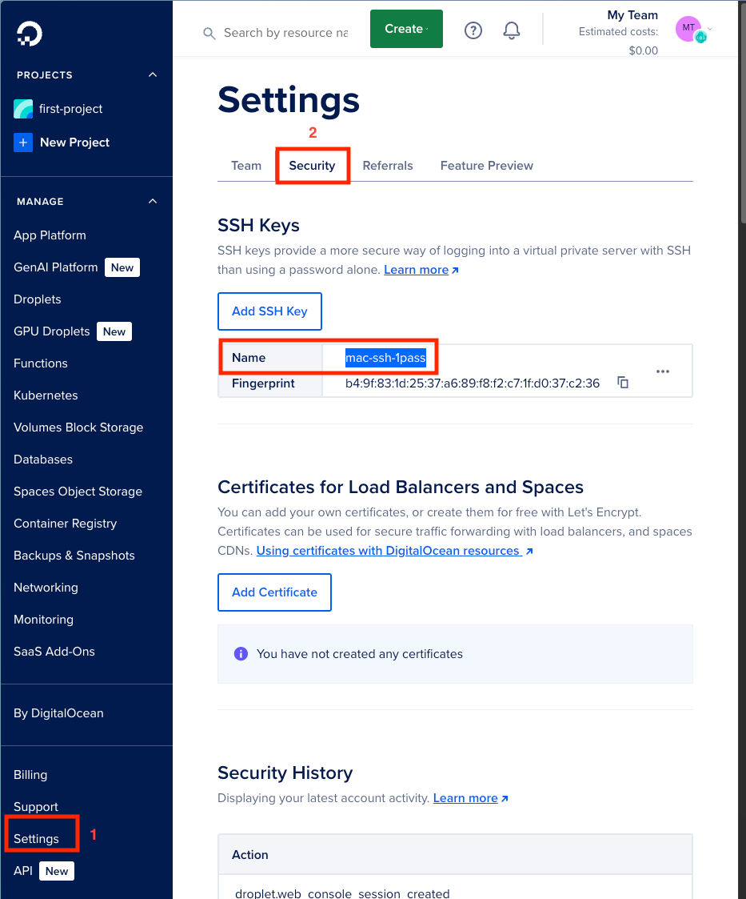
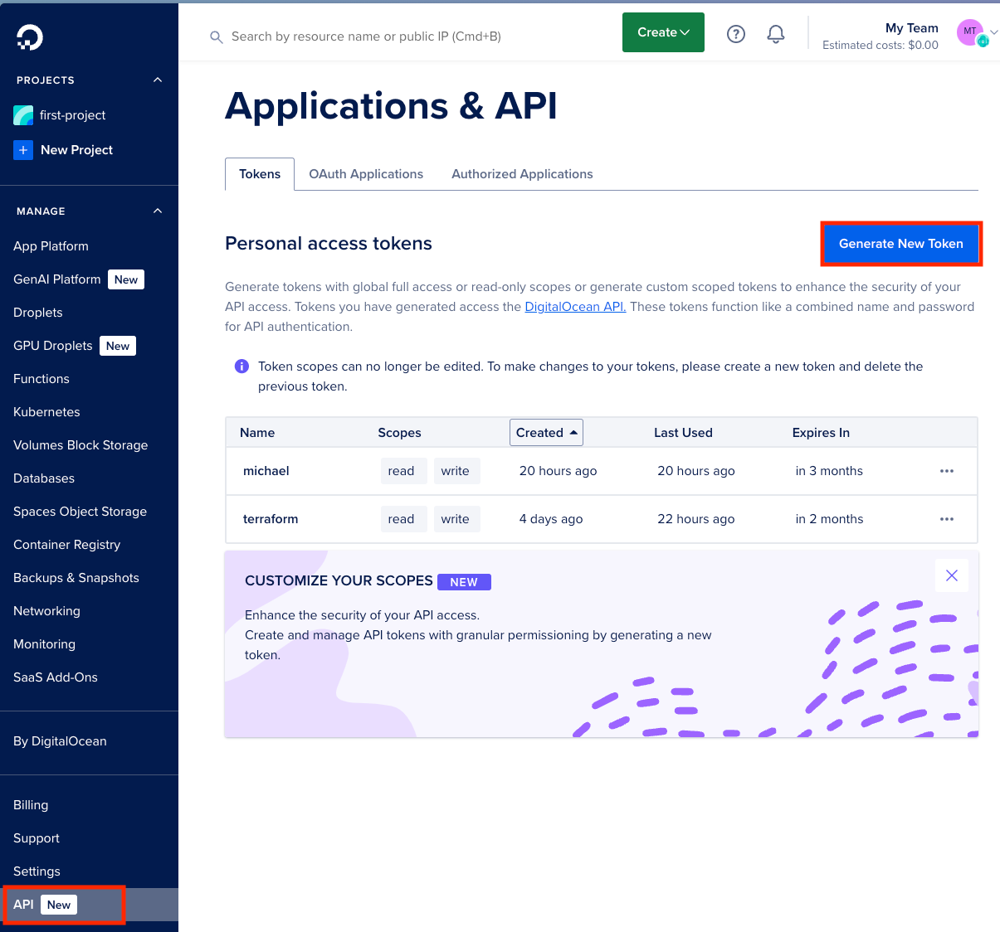
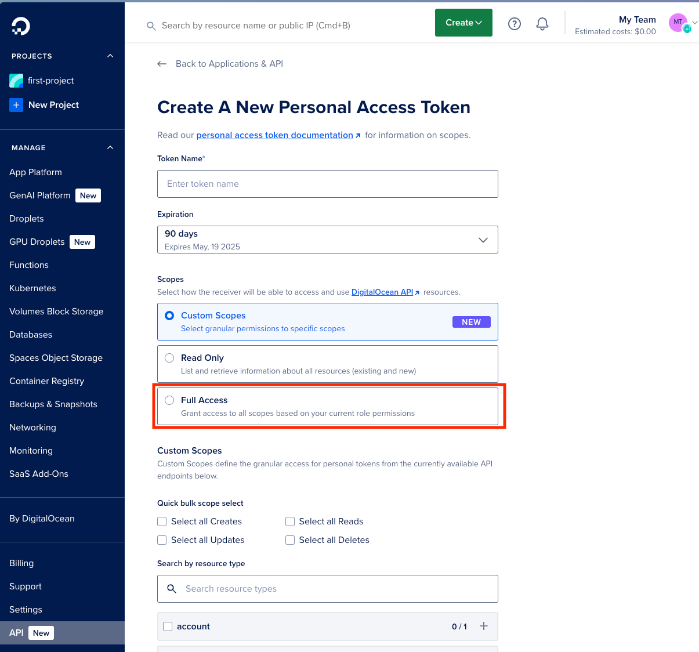

# Deployment of itu-minitwit-golang

## Terraform deployment

We use terraform to initialize the infrastructure. So far the infrastructure includes:

* VM (droplet) on DigitalOcean running ubuntu with docker installed
* Static IP address (Floating IP) on DigitalOcean

### How to deploy:

#### Ensure you have the following prerequisites:

* Terraform installed
* DigitalOcean SSH key added to your account
* DigitalOcean API token

#### Steps:

1. cd into the terraform directory:

```shell
cd deployments/terraform
```

2. Terraform initialize:

```shell
terraform init
```

3. Run Terraform plan (you will be prompted to enter your DigitalOcean API token and the ssh key name):







```shell
terraform plan
```

4. Apply the Terraform plan:

```shell
terraform apply
```

## Building and pushing the image

1. Authorize docker:

```shell
gh auth token | docker login ghcr.io --username $(gh api user --jq '.login') --password-stdin
```

> [!NOTE]
> If you don't have gh cli installed, you can use a personal access token instead.
> `echo "<your_token>" | docker login ghcr.io --username "<your_username>" --password-stdin


2. Build & push

```shell
docker build -t ghcr.io/alin-plamadeala/itu-minitwit-golang:<tag> .
docker push ghcr.io/alin-plamadeala/itu-minitwit-golang:<tag>
```

(if you are NOT on linux/amd64)

```shell
docker buildx build --platform linux/amd64 -t ghcr.io/alin-plamadeala/itu-minitwit-golang:1 . --push
```

## Deployment of the application

### Pre-requisites

* Public docker image repository
* SSH access to the VM
* Docker installed on the VM (we are using an image with docker pre-installed, so it should be there if you followed the terraform deployment)
* Docker-compose installed on the VM (we are using an image with docker pre-installed, so it should be there if you followed the terraform deployment)

### Steps

> [!NOTE]
> First time setup
> 1. Create docker context: `docker context create digitalocean --docker "host=ssh://root@<vm-public-ip>"`
> 2. Use the context: `docker context use digitalocean`
> 3. Init docker swarm: `docker swarm init --advertise-addr <vm-public-ip>`

1. Set docker context:

```shell
docker context use digitalocean
```

2. Deploy the application:

```shell
docker stack deploy -c docker-compose.yml itu-minitwit
```